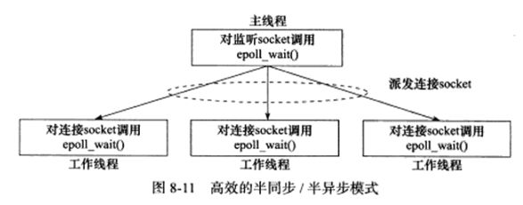

# HighPerformanceServer
仿《Linux高性能服务器编程》

## 半同步/ 半异步进程池实现
 

半同步/半异步框架属于同步I/O的一种，采用的事件处理模式为Recator模式:主线程（进程）只管理监听socket，连接socket由工作线程（进程）来管理。当有新的连接到来时，主线程（进程）就接受之并将新的连接socket派发给某个工作线程（进程），此后该新socket上的任何IO操作都由被选中的工作线程来处理，直到客户关闭连接。通过管道实现。

## 统一事件源
信号是一种异步事件：信号处理函数和程序的主循环是两条不同的执行路线。信号处理函数需要尽可能快地执行完毕，以确保该信号不被屏蔽太久。一种典型的解决方案是：把信号的主要处理逻辑放到程序的主循环中，当信号处理函数被触发时，它只是简单地通知主循环程序接收到信号，并把信号值传递给主循环，主循环再根据接收到的信号值执行目标信号对应的逻辑代码。信号处理函数通常使用**管道**来将信号“传递”给主循环：信号处理函数往管道的写端写入信号值，主循环则从管道的读端读出该信号值。

主循环怎么知道管道上何时有数据可读呢？只需要使用IO复用系统调用来监听管道的读端文件描述符上的可读事件

当有新的连接请求到来时，主进程只是接受这个请求，并向epoll内核中注册socket上的请求事件，它将新的连接派发给子进程处理，此后新socket上的任何I/O操作都由子进程处理，除此之外就是检测子进程工作状态和等待退出；子进程检测到管道内有数据，就分析是否是一个新的客户连接请求到来，如果是，则把新socket上的读写事件epoll到自己的内核事件表中。

## 采用单例模式
进程池的实现采用单例模式，只能同构create函数创建单例。
- C++11中可以保证static变量时多线程安全的，在底层实现了加锁操作，所以不需要像以前那样自己写加锁操作。
- 由于是一个static对象，可以保证对象只生成一次。
- 返回值需要是指针或者引用，不然会出现值拷贝